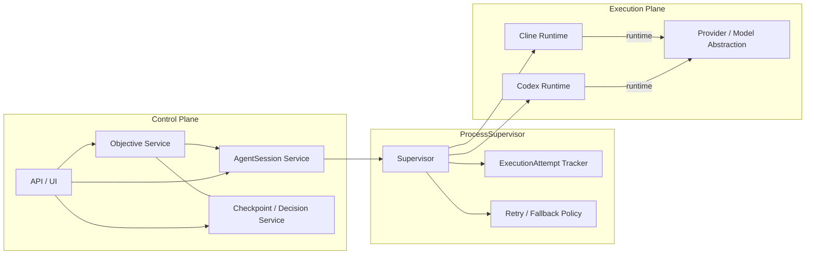
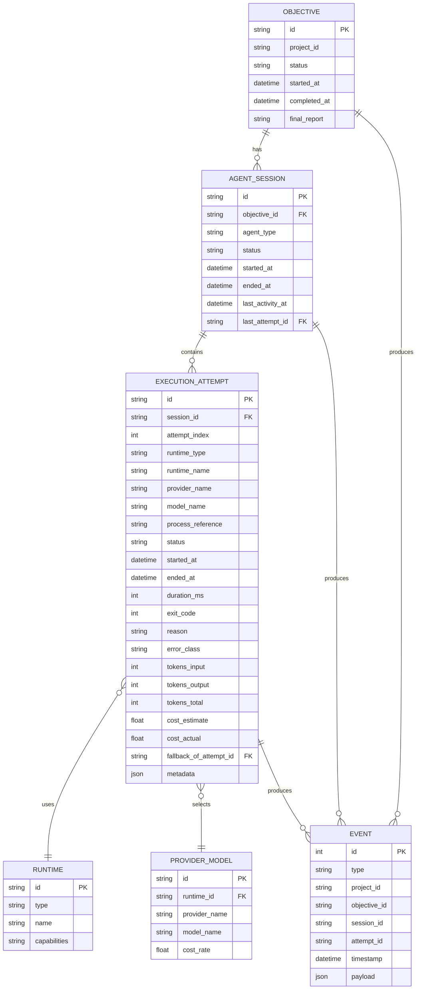
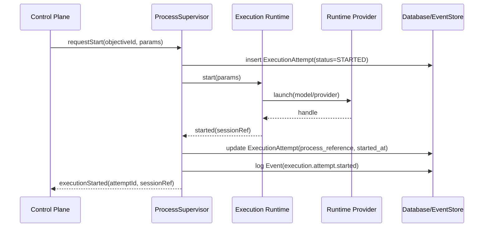
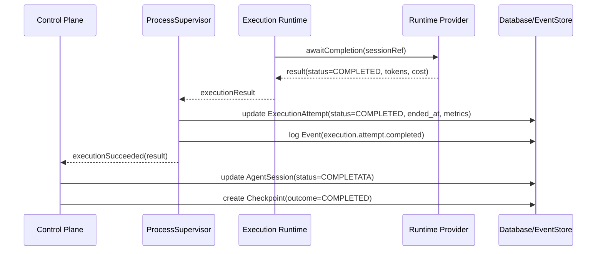
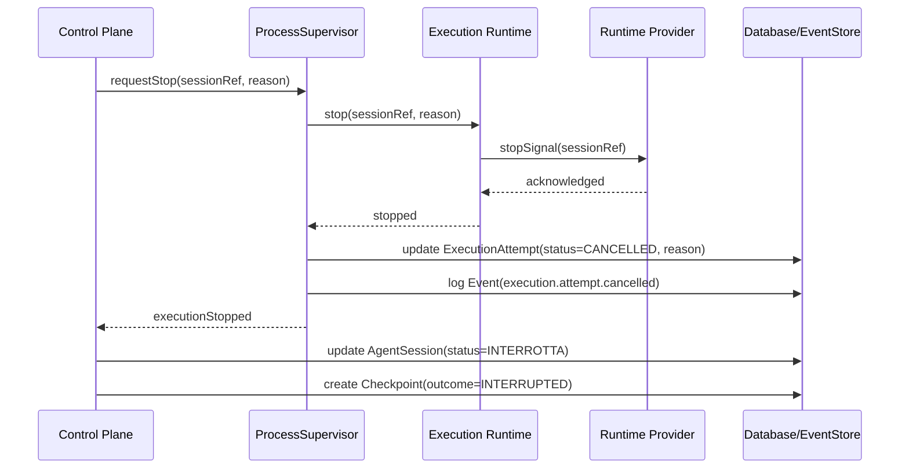
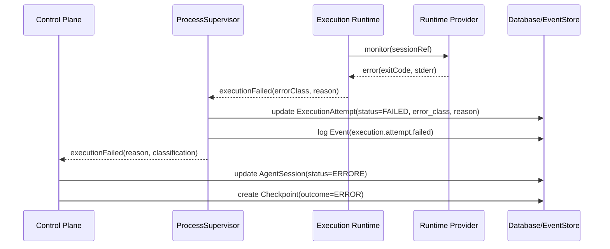
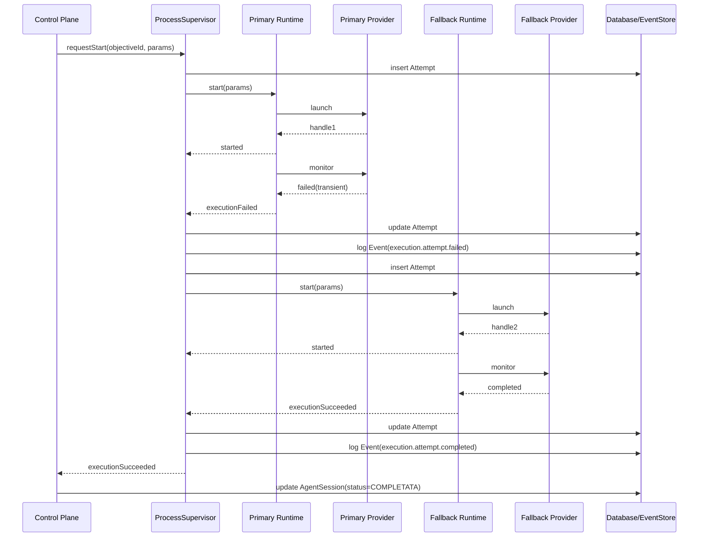

# Execution Plane Design for G-Rex Agent Control

**Documento di progettazione tecnica — Execution Plane**

Scopo: descrivere l’estensione architetturale minima per passare dall’attuale simulazione dell’agente a un Execution Plane reale, mantenendo la separazione netta tra Control Plane e Execution Plane.

## 1. Obiettivo

L’Execution Plane deve permettere a G-Rex Agent Control di:
- avviare processi agente reali;
- supervisionarli efficacemente;
- fermarli in modo affidabile;
- ricevere e classificare gli esiti;
- gestire retry e fallback;
- supportare futuri runtime multipli, in particolare Codex e Cline;
- tracciare tentativi di esecuzione, runtime/provider/model, durata, token e costo.

Nessuna implementazione è prevista in questo documento. Lo scope è esclusivamente progettuale.

## 2. Confine architetturale

Il sistema è composto da tre macro-livelli:

- `Control Plane`
- `ProcessSupervisor`
- `Execution Plane`

### 2.1 Control Plane

Responsabilità:
- definisce gli obiettivi e gestisce lo stato applicativo (`Objective`, `AgentSession`, `Checkpoint`, `Decision`);
- decide quando avviare, fermare o reagire a un’esecuzione;
- mantiene gli invarianti umani e le decisioni di approvazione;
- espone le API verso la UI e i client.

Non deve conoscere i dettagli di esecuzione runtime-specifici.

### 2.2 ProcessSupervisor

Funzione: boundary di orchestrazione tra Control Plane e Execution Plane.

Responsabilità:
- avvia ed arresta esecuzioni reali;
- crea e aggiorna i tentativi di esecuzione (`ExecutionAttempt`);
- normalizza i risultati runtime in un formato comune;
- gestisce retry e fallback entro lo stesso `Objective` e `AgentSession` autorizzati;
- collega gli esiti al Control Plane e agli eventi applicativi.

Il `ProcessSupervisor` può modificare solo gli `ExecutionAttempt` e gli eventi correlati. Solo il `Control Plane` può modificare `AgentSession`, `Objective` e `Checkpoint`.

### 2.3 Execution Plane

Responsabilità:
- materializza l’esecuzione concretamente su un runtime reale;
- fornisce capacità di start/stop/monitoring;
- cattura risultati, errori, token e costi;
- supporta diversi runtime come Cline e Codex, e provider/modello come OpenRouter.

Il Control Plane non deve contenere logica di gestione di processi esterni.

## 3. Architettura generale

### Note sul diagramma
- `Control Plane` è il livello che mantiene stato e decisioni.
- `ProcessSupervisor` è il punto di demarcazione: è lo strato che conosce i tentativi di esecuzione ma non prende decisioni di business su `Objective` e `Checkpoint`.
- `Execution Plane` sono i runtime concreti che eseguono realmente i processi.

## 4. Modello ER proposto

### Relazioni chiave
- `Objective` genera una o più `AgentSession`.
- una `AgentSession` raccoglie uno o più `ExecutionAttempt`.
- ogni `ExecutionAttempt` usa un singolo `Runtime` e un singolo `ProviderModel`.
- gli `Event` possono riferirsi a tutte e tre le entità.

`AgentSession` mantiene lo stato della sessione, mentre metadata di runtime, provider e modello sono conservati esclusivamente negli `ExecutionAttempt`.

## 5. Contratti e responsabilità

### Control Plane
- decide l’avvio e lo stop delle sessioni;
- assegna uno `AgentSession` ad un `Objective`;
- aggiorna stato di `AgentSession`, `Objective` e `Checkpoint` in base all’esito normalizzato;
- applica le politiche di retry/fallback entro lo stesso `Objective` e `AgentSession` autorizzati;
- non interpreta i dettagli runtime specifici.

### ProcessSupervisor
- riceve `start/stop/heartbeat` dal Control Plane;
- crea e aggiorna solo i `ExecutionAttempt`;
- seleziona il runtime da usare;
- normalizza risultati e errori;
- applica politiche di retry/fallback entro lo stesso `Objective` e `AgentSession` autorizzati;
- genera eventi `execution.attempt.*`.

### Execution Plane
- esegue il processo reale;
- restituisce handle e risultati concreti;
- fornisce diagnosi e metriche di esecuzione;
- supporta stop affidabile.

## 6. Invarianti

- il Control Plane mantiene la separazione: nessuna logica di processo in `ObjectiveService` o `AgentSessionService`;
- un `AgentSession` non cambia stato direttamente da un runtime; gli esiti sono mediati da `ProcessSupervisor` e quindi confermati dal Control Plane;
- un `ExecutionAttempt` è un’entità persistente con un lifecycle interno che può essere aggiornato, ma il tentativo specifico rimane identificabile e non viene sostituito da un nuovo record per lo stesso tentativo;
- il retry è possibile solo su errori classificati come `TRANSIENT`;
- il fallback non rimuove lo storico del tentativo primario;
- retry e fallback possono avvenire automaticamente esclusivamente all’interno dello stesso `Objective` e `AgentSession` già autorizzati, e non possono avviare un nuovo `Objective` né bypassare una decisione umana;
- lo stato terminale dell’obiettivo richiede sempre una decisione umana quando previsto.

## 7. Sequence diagrams principali

### 7.1 Avvio normale

### 7.2 Completamento

### 7.3 Stop umano

### 7.4 Errore runtime

### 7.5 Retry e fallback

La policy di retry e fallback può essere applicata automaticamente solo se l’`Objective` e l’`AgentSession` sono già autorizzati dal Control Plane. Non può creare un nuovo `Objective`, né finalizzare un nuovo ciclo di lavoro al posto di una decisione umana.

## 8. Runtime e provider supportati

### Runtime
- `Cline` — processo CLI locale in modalità headless.
- `Codex` — runtime AI interno o locale basato su Codex.

### Provider / Model
- `OpenRouter` è un provider/modello e non un runtime. Deve essere modellato come `ProviderModel` associato a un `ExecutionAttempt`.
- `Codex` può essere sia runtime sia provider, ma deve essere trattato come provider identificabile quando viene usato come provider.
- il modello effettivo scelto è metadata di `ExecutionAttempt`, non di `AgentSession`.

### Runtime vs Provider
- i runtime (`Cline`, `Codex`) sono l’infrastruttura esecutiva.
- i provider/modello (`OpenRouter`, `Codex` come provider) specificano il modello concretamente usato per l’esecuzione.

## 9. Eventi chiave

Gli eventi dell’Execution Plane devono essere memorizzati nel `EventStore` esistente con riferimento alle entità:
- `execution.attempt.started`
- `execution.attempt.completed`
- `execution.attempt.failed`
- `execution.attempt.failed.terminal`
- `execution.attempt.cancelled`
- `execution.attempt.fallback`
- `execution.attempt.heartbeat`

Questi eventi supportano osservabilità e audit.

`execution.attempt.failed` indica un errore recuperabile/transient, mentre `execution.attempt.failed.terminal` indica un fallimento definitivo dopo che la policy di retry/fallback è stata esaurita.

## 10. Decisioni ancora aperte

- **Retry policy esatta:** numero massimo di retry e backoff devono essere definiti quando si implementa il supervisor.
- **Fallback order e priorità:** quale runtime/provider è fallback primario, e con quale criterio viene scelto.
- **Token/costo nei runtime locali:** se `Codex` locale fornisce token/costo, come normalizzarlo rispetto ad OpenRouter.
- **Heartbeat timeout:** soglia precisa per considerare un `ExecutionAttempt` non più rispondente.

---

Documento creato per la progettazione dell’Execution Plane. Non sono state apportate modifiche al codice.